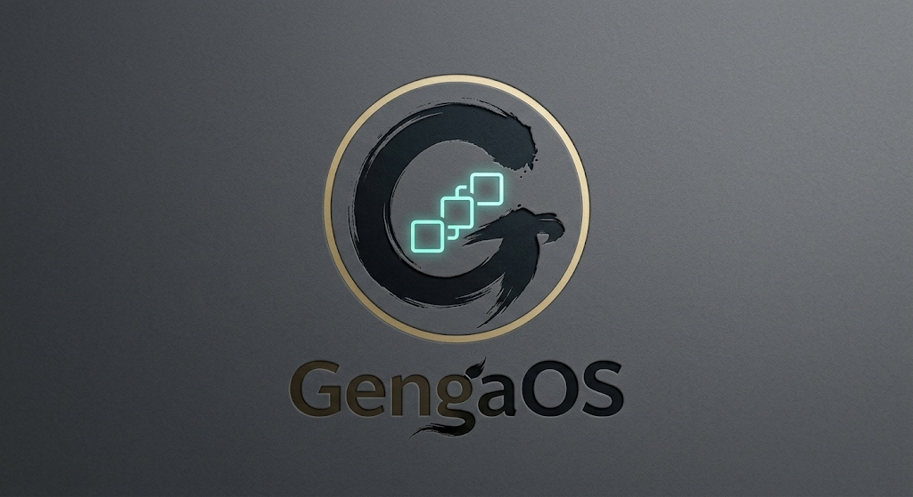

<div align="center">
  
  
  <h1>GengaOS</h1>
  <p><b>The "Director-First" Generative Anime Operating System</b></p>
  
  <p>
    <a href="#the-problem">The Problem</a> • 
    <a href="#the-gengaos-architecture">The Architecture</a> • 
    <a href="#the-technology-stack">Tech Stack</a> • 
    <a href="#installation">Installation</a>
  </p>
</div>

---

## 🛑 The Problem: The AI "Slot Machine"
Right now, the AI Video and Animation space is broken. If you are an Indie Anime Director trying to produce a 24-minute cinematic episode, you quickly realize that typing *"Action sword fight scene, hyper-detailed"* into a Discord bot or a web wrapper is fundamentally useless for production. 

You cannot direct an anime by pulling the lever on a random visual slot machine. You get flickering characters, terrible pacing, zero continuity, and an inability to hit specific script timing.

A real anime studio doesn't use "prompts". They use **Settei** (Character Model Sheets), **Ekonte** (Storyboards), **Sakuga** (Keyframe Kinetics), and **Dope Sheets** (Timing ledgers).

---

## 🎬 The Solution: GengaOS
GengaOS is an open-source, node-based workspace that brutally enforces traditional animation constraints onto chaotic Machine Learning models. 

Built on a massive **React Flow** architectural canvas and backed by a **Rust/Tauri** native backend, GengaOS acts as a visual orchestration engine. It forces the AI to yield absolute creative control back to the human artist sitting in the director's chair.

### Why You Will FOMO If You Only Use standard Web-UI's:
If you are generating videos via standard browser AI tools, you are losing out on the mathematical control that GengaOS explicitly hardwires into your pipeline:

#### 1. Absolute Character Locking (The Settei Node)
*   **The Problem:** Your protagonist's jacket changes shape, color, and design every single frame. 
*   **The OS Fix:** Before you generate a single frame, GengaOS forces you to connect a **Settei Node**. This takes your character's foundational turn-around sheet and aggressively hooks it into an **IP-Adapter FaceID/Plus** pipeline. The AI is no longer "guessing" who the character is—it is mathematically forced to lock their visual identity across every shot in the ecosystem.

#### 2. True Sakuga Extraction (Video-to-Video Kinematics)
*   **The Problem:** AI Text-to-Video generators produce floaty, blurry, and physically inaccurate martial arts fights. 
*   **The OS Fix:** GengaOS features a dedicated **Sakuga Action Engine**. You drop a raw `.mp4` of real live-action fight choreography into the Node. GengaOS runs **DWPose (DensePose)** over every frame, stripping away the video but keeping the pure kinetic OpenPose skeleton. It feeds this skeleton, along with your *Settei Node*, into **AnimateDiff + ControlNet**, physically tracing the hyper-kinetic momentum of a real stunt sequence onto your Anime character.

#### 3. 2.5D Multiplane Parallax Separation
*   **The Problem:** AI video looks flat. There is no cinematic depth or dynamic camera shifting.
*   **The OS Fix:** The GengaOS **Multiplane Node** takes your "flat" generation and runs it through a local **Depth-Anything-V2** model. It physically slices the image into completely separated Foreground (FX/Smoke), Midground (Actor), and Background (Scenery) image layers. You can then map **Deforum** camera sweeps across these separated planes, producing mind-blowing cinematic parallax that feels like an Ufotable production.

#### 4. The Sync-Locked Dope Sheet (Audio-Visual Linking)
*   **The Problem:** Slapping dialogue onto a silent video afterward makes the lip-sync look amateur.
*   **The OS Fix:** The OS includes a literal Japanese "X-Sheet" Timeline Node. It maps an immediate, visual SVG waveform underneath your frame sequencer. When you input an audio file from a Local TTS, the system extracts the specific phonetic Visemes (`A, E, I, O, U, M`) and mathematically links them to your visual frames, orchestrating flawless **Wav2Lip** syncing. 

---

## ⚙️ The Technology Stack & Philosophy

We did not build another generic thin-client wrapper. GengaOS is a heavy-duty production environment. 

### Frontend Orchestration (The Studio)
*   **React Flow & Vite:** The entire canvas is a heavily customized Directed Acyclic Graph (DAG). Every node has its own isolated state management, allowing massive, sprawling episodic workflows on a single panning 2D screen. 
*   **React-Three-Fiber (R3F):** (Coming Soon) We embed physical 3D WebGL WebXR instances directly inside the nodes, allowing directors to physically block out "dummy mannequins" before rendering.

### Backend Routing (Absolute Hardware Freedom)
*   **Tauri v2 (Rust):** The React frontend is compiled into a lightweight native `.dmg` / `.exe` using Rust. It runs identically to a native Mac/Windows app, with extreme performance.
*   **Python Fast-API Sidecar:** The Tauri shell invisibly boots a local Python API in the background. 

### Why the BYOK (Bring Your Own Key) Router is Essential
We despise platform lock-in. **GengaOS does not charge you a subscription fee.**

Inside the UI, the **Hardware Compute Core** allows you to explicitly route your entire graph:
1.  **For users without a massive Gaming PC:** You select `Cloud: Fal.ai` or `OpenAI`. You plug in your raw API keys securely (stored locally via Rust, never in the browser). You pay fractions of a penny per shot with massive generation speed.
2.  **For users with an RTX 4090 / M3 Max:** You select `Local: ComfyUI (Port 8188)` and `Local: Ollama (Port 11434)`. GengaOS will serialize the stunning Node Graph you built and automatically translate it into **ComfyUI JSON Workflows**, pumping it directly into your local machine's GPU pipeline. You generate unlimited AAA anime locally, completely offline, for absolutely free. 

---

## 🚀 Getting Started

*Note: The official 1-Click Installer `.dmg` is currently undergoing compilation audits for the public release.*

### Developer Setup (Studio Mode)

If you are a Node.js / Python developer and want to run the React Studio canvas locally right now:

```bash
# 1. Clone the repository
git clone https://github.com/0x404ethsol/GengaOS.git
cd GengaOS/apps/web-studio

# 2. Install Dependencies
npm install

# 3. Boot the React Flow UI Canvas
npm run dev
```

### Starting the Python Intelligence Sidecar
To ensure the graph connects and serializes properly, boot the internal API sidecar:

```bash
# In a second terminal window
cd apps/web-studio/src-tauri/bin/
pip install fastapi uvicorn pydantic httpx
python sidecar.py
```

---
*Built from the ground up to save Indie Anime. Orchestrated by 0x404ethsol.*
